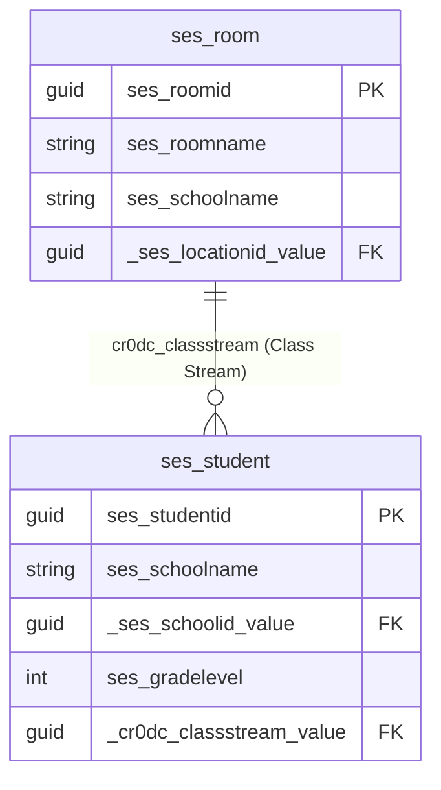

# Dataverse relationships: streams (`ses_rooms`) and students (`ses_students`)

## Entity sets vs logical names

| Concept | Value |
|--------|--------|
| Stream table (API entity set) | `ses_rooms` |
| Stream record logical name | `ses_room` |
| Primary key | `ses_roomid` |
| Student table (API entity set) | `ses_students` |
| Student record logical name | `ses_student` |
| Primary key | `ses_studentid` |

## Official link: Class Stream (many students → one room)

From Dataverse metadata (`EntityDefinitions(LogicalName='ses_student')/ManyToOneRelationships`):

| Property | Value |
|----------|--------|
| Schema name | `cr0dc_ses_student_ClassStream_ses_room` |
| Type | One-to-many (**one** `ses_room`, **many** `ses_students`) |
| On student (lookup field) | `cr0dc_classstream` |
| On student (OData GUID) | `_cr0dc_classstream_value` |
| On student (navigation) | `cr0dc_ClassStream` → single related room |
| On room (navigation) | `cr0dc_ses_student_ClassStream_ses_room` → collection of students |
| Referenced key on room | `ses_roomid` |

### Example room (stream)

```json
{
  "ses_roomid": "c529f8d8-490e-f111-8407-000d3a67e77c",
  "ses_room": "Grade Seven S",
  "ses_roomname": "Grade Seven S",
  "ses_schoolname": "Pioneer Junior Academy",
  "ses_locationname": "Samar",
  "_ses_locationid_value": "82552c1b-b74a-f011-877a-7c1e5237ad4c"
}
```

### How to query students for that stream

**1. Navigation from room (preferred when Class Stream is populated):**

```http
GET https://piuprod.api.crm4.dynamics.com/api/data/v9.2/ses_rooms(c529f8d8-490e-f111-8407-000d3a67e77c)/cr0dc_ses_student_ClassStream_ses_room
```

Optional query (recommended):

```http
GET .../ses_rooms(c529f8d8-490e-f111-8407-000d3a67e77c)/cr0dc_ses_student_ClassStream_ses_room?$select=ses_studentid,ses_studentname,piu_admissionnumber&$top=500
```

**Invalid URL (do not use):** `ses_rooms?/ses_rooms(...)/...` — the `?` must not appear between the entity set and the key. Use `ses_rooms({id})/navigation`, not `ses_rooms?/ses_rooms({id})/...`.

**2. Filter students by lookup:**

```http
GET https://piuprod.api.crm4.dynamics.com/api/data/v9.2/ses_students?$filter=_cr0dc_classstream_value eq c529f8d8-490e-f111-8407-000d3a67e77c&$select=ses_studentid,ses_studentname&$top=500
```

For this PIU environment, use the **bare GUID** (no `guid'...'` wrapper):

- Navigation: `ses_rooms(c529f8d8-490e-f111-8407-000d3a67e77c)/cr0dc_ses_student_ClassStream_ses_room`
- Filter: `_cr0dc_classstream_value eq c529f8d8-490e-f111-8407-000d3a67e77c`

Using `guid'...'` or selecting non-existent columns (e.g. `firstname`, `lastname` on `ses_student`) returns zero rows.

## Other fields (not the stream link)

### On `ses_room`

| Field | Role |
|-------|------|
| `ses_schoolname` | Denormalized school **text** (not a lookup) |
| `_ses_locationid_value` | Lookup to campus/location |
| `_ses_courseid_value` | Optional course link (often null) |
| `ses_roomtype` | Room type option set |

There is **no** `_ses_schoolid_value` on the room record; school is matched via `ses_schoolname`.

### On `ses_student`

| Field | Role |
|-------|------|
| `ses_schoolname` | Denormalized school text |
| `_ses_schoolid_value` | Lookup to school (`account`) |
| `ses_gradelevel` | Grade option set (integer code, e.g. `284210004`) |
| `_cr0dc_classstream_value` | **Class Stream** → `ses_room` (null = not assigned to a stream) |
| `piu_admissionnumber` / `ses_studentname` | Identity / display |

`ses_classname` is **not** present on typical PIU student records; do not rely on it for stream matching.

## Diagram



## Roll-call app behaviour

1. **Streams list** — loaded from `ses_rooms` filtered by `ses_schoolname` (mapped from header school).
2. **Students for a stream** — tries, in order:
   - `ses_rooms({roomId})/cr0dc_ses_student_ClassStream_ses_room`
   - `ses_students` where `_cr0dc_classstream_value eq {roomId}`
   - Fallback: same school + `ses_gradelevel` matching grade parsed from room name (e.g. “Grade Seven S” → Grade 7), which returns **all** streams in that grade if Class Stream is empty.

## Fixing empty rosters

In Dataverse, on each `ses_student` record set **Class Stream** (`cr0dc_classstream`) to the correct `ses_room` (e.g. “Grade Seven S”). Until that lookup is set, the app cannot distinguish “S” vs “N” vs “East” within the same grade.
