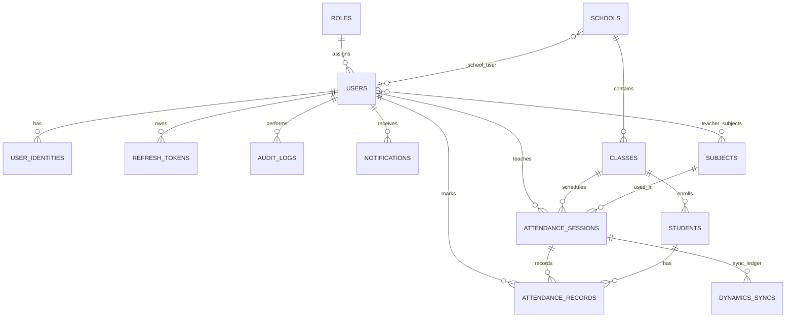

# Entity Relationship Diagram (ERD)

## Core tables

- `users`, `roles`, `user_identities`, `refresh_tokens`
- `schools`, `classes`, `school_user`, `teacher_subjects`
- `students`, `subjects`
- `attendance_sessions`, `attendance_records`
- `dynamics_syncs`
- `audit_logs`, `notifications`
